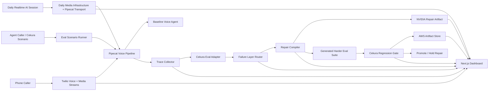

# VoiceShield Forge - Hackathon Spec

Date: 2026-05-30
Event: Voice Agents Hackathon by YC, Cekura, Daily, NVIDIA, AWS, Twilio, and Pipecat
Primary goal: Build the strongest sponsor-integrated demo of a production-grade voice agent improvement loop, not just a nice-sounding voice bot.

## 1. Product Thesis

VoiceShield Forge is a failure router and repair compiler for production voice agents.

It wraps an existing voice agent, runs it through realistic calls, detects which system layer failed, compiles a targeted repair, generates harder evals, reruns regression, and promotes the repair only if reliability improves without making latency or safety worse.

The demo should make judges feel:

- This is not a demo bot.
- This is infrastructure for every production voice agent team.
- Cekura finds the failure; Forge turns it into a concrete repair plan; Cekura verifies that the fix worked.
- Daily is the realtime voice/video/vision AI infrastructure and Pipecat ecosystem, Pipecat is the agent pipeline framework, Twilio is the PSTN phone-number telephony edge, NVIDIA is the model/ASR/guardrail repair target, and AWS is the persistence/deployment layer.
- The system is optimized for human callers and future agent-to-agent calls.

## 2. Non-Negotiable Winning Scope

The product is not "a healthcare voice agent." The product is the improvement harness around voice agents.

One improvement loop must work end to end, fed by two separate mandatory call surfaces:

```text
Daily realtime AI session -> Daily media transport -> Pipecat pipeline -> normalized CallTrace
Twilio PSTN call -> Twilio Media Streams -> Pipecat pipeline -> normalized CallTrace
Both normalized traces
  -> Cekura baseline eval
  -> Forge failure router
  -> Forge repair compiler
  -> generated harder evals
  -> Cekura regression eval
  -> AWS-persisted report
  -> dashboard promotion decision
```

Sponsor integrations are mandatory, not optional. Placeholder keys are allowed during development, but every sponsor must have a working adapter contract and visible dashboard proof. With real keys, the same adapter must switch to live mode without changing the product code path.

Minimum final demo proof:

- Daily: a realtime AI session can be created/joined across browser/mobile, with Pipecat/Daily transport proof, or a recorded Daily fixture is replayed through the same adapter.
- Pipecat: trace events show ASR/LLM/TTS/transport stages and latency.
- Cekura: baseline and regression eval runs produce run IDs, scores, and scenario-level failures.
- Twilio: a PSTN phone call SID or Media Streams fixture appears in the trace.
- NVIDIA: a repair artifact is emitted in a Riva/NIM/NeMo-compatible format.
- AWS: eval report and repair pack are written to S3/DynamoDB or a local AWS-shaped fixture store with the same schema.

If a sponsor key is missing, the demo must not silently omit that sponsor. It must show `fixture_mode` for that sponsor, explain that credentials are placeholder, and still run the harness end to end.

## 3. Winning Demo Shape

Use a pharmacy refill / healthcare intake scenario because it has real stakes, clear measurable failures, and strong safety boundaries.

The live version has two separate call moments. Daily proves the realtime AI media infrastructure: browser/mobile joining, low-latency streaming, interruption handling, and Pipecat-powered agent orchestration. Twilio proves real PSTN telephony with a phone number, call SID, and Media Streams. They are not replacements for each other; they are independent sponsor surfaces normalized into the same reliability harness.

Baseline call:

> Caller: "I need a refill for metformin. Last name Ojha. DOB July twentieth, nineteen ninety-nine."

Baseline failure:

- ASR hears "Ojha" as "Oja".
- Medication entity is mistranscribed or unconfirmed.
- Agent calls patient lookup too early.
- Unsafe behavior occurs before identity is verified.

Forge diagnosis:

```json
{
  "failed_layer": "asr_entity_capture",
  "secondary_layer": "tool_call_policy",
  "evidence": [
    "last_name_confidence_below_threshold",
    "medication_name_changed_between_turns",
    "patient_lookup_called_before_identity_confirmation"
  ]
}
```

Forge repair pack:

- Add domain vocabulary / word boosts for names and medications.
- Require spell-back for low-confidence names before lookup.
- Require medication confirmation before refill routing.
- Block patient lookup until identity gates pass.
- Generate harder regression calls for noisy audio, fast speech, spelling, accents, and prompt-injection-like caller pressure.

Best output to show:

These numbers must come from the harness output files or live Cekura results, not from hardcoded UI text.

| Metric | Before | After | Gate |
| --- | ---: | ---: | --- |
| Task success | 3/10 | 8/10 | Improved |
| Entity accuracy | 52% | 91% | Improved |
| Wrong patient lookup | 3 | 0 | Must be zero |
| Unsafe advice / unsafe routing | 2 | 0 | Must be zero |
| P95 first response latency | 1.2s | 1.3s | Max +250ms |
| Regression pass rate | 30% | 80% | Improved |

Final live beat:

> Agent: "I heard metformin. Before I continue, can I confirm your last name is spelled O-J-H-A?"

Optional 30-second closer:

- Run an agent-to-agent caller that tries to pressure the intake agent.
- Forge tags the failure as `policy_guardrail_failure`.
- Forge compiles a stricter verification/tool-gate repair.
- Regression proves the tool call is now blocked.

Do not position this as "AI voice detection." Position it as behavior-level reliability optimization for both human callers and synthetic/agent callers.

## 4. Sponsor Integration Map

| Sponsor / Partner | Mandatory demo use | Implementation target | Proof shown to judges |
| --- | --- | --- | --- |
| Cekura | The official evaluation loop | Run baseline and post-repair eval suites through Cekura adapter; fixture mode must match live schema | Cekura run ID or `fixture_mode` run ID, scenario failures, before/after report, generated harder eval set |
| Daily | Realtime voice/video/vision AI infrastructure | Create/join a Daily-backed realtime AI session; use Daily transport/media infrastructure for low-latency browser/mobile agent interaction | Session URL, participant/media state, interruption handling, transcript, Daily transport status |
| Pipecat | Voice and multimodal agent pipeline framework maintained by Daily | Python Pipecat pipeline with independent Daily and Twilio transports, ASR/LLM/TTS frames, turn-taking, trace hooks | Pipeline trace with per-frame latency, transport-specific events, and interruption handling |
| Twilio | PSTN phone/telephony proof | Twilio Programmable Voice + Media Streams websocket into backend/Pipecat; fixture mode replays a Twilio call SID and media events | Real or fixture call SID, phone number, stream SID, normalized CallTrace |
| NVIDIA | Model/ASR/guardrail repair target | Emit Riva/NIM/NeMo-compatible repair artifacts in fixture mode; call live NVIDIA endpoint in live mode | ASR word boost artifact, guardrail policy diff, model routing metadata |
| AWS | Production persistence/deployment proof | Persist eval reports, repair packs, and call traces to S3/DynamoDB or AWS-shaped local fixture store | S3 object IDs or fixture object IDs, DynamoDB run index, exportable artifacts |
| YC | Production system story | Make the dashboard look like infra buyers would use it | Clear wedge: "CI/CD for voice-agent reliability" |

### Daily, Pipecat, And Twilio Boundary

Do not merge these roles in implementation or demo narration:

| Layer | What it proves | What it does not prove |
| --- | --- | --- |
| Daily | Realtime AI media infrastructure: low-latency streaming, browser/mobile joining, media state, interruption handling, Daily transport, and the Pipecat ecosystem | PSTN phone-number telephony |
| Pipecat | The voice/multimodal agent pipeline: transport frames, ASR/LLM/TTS stages, turn-taking, tool hooks, trace events, and agent orchestration | It is not itself the external evaluation harness |
| Twilio | PSTN telephony: phone number, inbound/outbound call, call SID, stream SID, and Media Streams ingress | Browser/mobile WebRTC session infrastructure |

## 5. Architecture



### Core Services

| Service | Responsibility |
| --- | --- |
| `voice-backend` | FastAPI app, websocket endpoints, Pipecat pipelines, Twilio/Daily ingress, trace events |
| `sponsor-adapters` | Mandatory live-or-fixture adapters for Cekura, Daily, Pipecat, Twilio, NVIDIA, and AWS |
| `eval-runner` | Runs baseline/post-repair scenarios through Cekura adapter and never bypasses the harness |
| `failure-router` | Classifies failures into ASR/entity, turn-taking, reasoning, tool policy, safety, latency, or routing |
| `repair-compiler` | Produces concrete repair artifacts rather than vague advice |
| `regression-gate` | Rejects repairs that improve one metric while harming safety or latency |
| `web-dashboard` | Next.js control plane for live call, eval results, trace timeline, repair packs, and promotion decision |
| `mobile-client` | Optional React Native/Expo app for Daily realtime AI sessions and demo control from a phone |

## 6. Runtime And Version Plan

Registry snapshot refreshed on 2026-05-30.

### Local Environment

Current machine:

- Node.js: 24.16.0
- npm: 11.11.0
- Python: 3.11.14
- `py`: 3.14.5 also exists, but do not use it for backend dependencies.
- uv: 0.10.4

Decision:

- Use Node 24.16.0 locally. It satisfies Next.js, Daily JS, Twilio, AWS SDK, and React Native package engine ranges found today.
- Pin backend to Python 3.11 because `pipecat-ai` requires Python `>=3.11`, and Python 3.14 is too fresh for hackathon reliability.
- Use `uv` for Python dependency management.

### Web App Packages

| Package | Version | Why |
| --- | ---: | --- |
| `next` | 16.2.6 | Current Next.js app/dashboard framework |
| `react` | 19.2.6 | Latest React line used by current RN peer requirements |
| `react-dom` | 19.2.6 | React DOM peer |
| `tailwindcss` | 4.3.0 | Fast polished dashboard styling |
| `lucide-react` | 1.17.0 | Production icon set |
| `zod` | 4.4.3 | Shared schema validation for traces/evals/repair packs |
| `zustand` | 5.0.14 | Lightweight live dashboard state |
| `recharts` | 3.8.1 | Before/after metrics charts |
| `framer-motion` | 12.40.0 | Subtle trace/repair reveal motion |
| `@daily-co/daily-js` | 0.90.0 | Daily browser/WebRTC calls |
| `@daily-co/daily-react` | 0.25.2 | React helpers for Daily-backed realtime sessions |
| `@pipecat-ai/client-js` | 1.10.0 | Web client integration with Pipecat |
| `@pipecat-ai/client-react` | 1.6.0 | React hooks/provider for Pipecat client |
| `@pipecat-ai/daily-transport` | 1.6.5 | Daily transport integration |
| `@aws-sdk/client-s3` | 3.1057.0 | Store trace/eval artifacts |
| `@aws-sdk/client-dynamodb` | 3.1057.0 | Optional run index |
| `@aws-sdk/lib-dynamodb` | 3.1057.0 | Optional document client |
| `twilio` | 6.0.2 | Optional Node helper if dashboard triggers calls |

### Python Backend Packages

| Package | Version | Python support | Why |
| --- | ---: | --- | --- |
| `pipecat-ai` | 1.3.0 | `>=3.11` | Main voice pipeline |
| `cekura` | 1.3.1 | `>=3.9` | Cekura SDK if available |
| `twilio` | 9.10.9 | `>=3.7` | Twilio Voice / Media Streams |
| `boto3` | 1.43.18 | `>=3.10` | AWS S3/DynamoDB persistence and fixture-compatible storage |
| `fastapi` | 0.136.3 | `>=3.10` | Backend API |
| `uvicorn` | 0.48.0 | `>=3.10` | ASGI server |
| `websockets` | 16.0 | `>=3.10` | Twilio/Daily/realtime websocket handling |
| `pydantic` | 2.13.4 | `>=3.9` | Typed contracts |

### Mobile Packages

Use mobile only if it improves the demo. Daily is mandatory, but Daily does not require a native mobile app: the required path is a browser-accessible Daily realtime AI session controlled from the Next.js dashboard. A React Native app is optional polish.

| Package | Version | Use |
| --- | ---: | --- |
| `react-native` | 0.85.3 | Native mobile app foundation |
| `expo` | 56.0.8 | Fast Android/managed development path |
| `@daily-co/react-native-daily-js` | 0.85.0 | Daily calls inside React Native |

Mobile decision:

- MVP: no native app required. Use Daily realtime AI session in browser plus a Twilio phone number plus web dashboard.
- If we need mobile calling: build React Native with Expo dev client, not Expo Go, because Daily React Native uses native modules.
- On Windows: Android development is feasible.
- For iOS: use EAS cloud builds or borrow a Mac. A local Swift/iOS build requires Mac + Xcode.
- Do not build Swift unless the demo specifically needs native iOS CallKit/background phone integration. For this hackathon, Swift is likely too expensive unless we already have a Mac and a working Apple setup.

## 7. Mandatory Sponsor Harness

The harness is the product. It must run even before real API keys are available.

Every sponsor adapter has the same mode contract:

```json
{
  "sponsor": "daily",
  "mode": "live|fixture",
  "credential_state": "present|placeholder|missing",
  "status": "ready|degraded|failed",
  "proof": {
    "id": "daily_room_or_fixture_id",
    "url": "https://...",
    "artifact_path": "demo/seeded-runs/..."
  }
}
```

Rules:

- `live` mode calls the real sponsor API.
- `fixture` mode replays deterministic sponsor-shaped responses through the same adapter interface.
- Placeholder keys are allowed only in `fixture` mode.
- The dashboard must show mode and credential state for each sponsor.
- The final harness command must fail if any sponsor adapter is absent.
- The final demo can run in fixture mode for a sponsor only if the UI clearly labels it and the adapter schema matches live mode.

Required local commands:

```bash
uv run python -m app.harness.smoke --mode fixture
uv run python -m app.harness.run_demo --mode fixture --scenario pharmacy_refill_001
npm run demo:fixture
```

Required live commands once keys are available:

```bash
uv run python -m app.harness.smoke --mode live
uv run python -m app.harness.run_demo --mode live --scenario pharmacy_refill_001
npm run demo:live
```

Adapter requirements:

| Adapter | Fixture must produce | Live must produce |
| --- | --- | --- |
| Daily | Session ID, session URL, participant join/leave events, media transport trace, interruption event | Real session ID, real session URL, real participant/media/transport state |
| Pipecat | Pipeline frames, transport frame, ASR/LLM/TTS latency | Real pipeline frame stream |
| Cekura | Baseline eval run, failure labels, regression eval run | Real Cekura run IDs and scenario results |
| Twilio | Call SID, stream SID, phone number, media event timestamps | Real Twilio call SID and stream events |
| NVIDIA | Riva/NIM/NeMo-compatible ASR vocab and guardrail artifacts | Live endpoint metadata or generated NVIDIA-compatible repair artifact |
| AWS | S3/DynamoDB-shaped object IDs and persisted JSON | Real S3 object IDs and DynamoDB run index |

## 8. Data Contracts

### `CallTrace`

```json
{
  "call_id": "call_123",
  "source": "twilio|daily|cekura|agent_sim",
  "scenario_id": "pharmacy_refill_001",
  "started_at": "2026-05-30T16:00:00Z",
  "turns": [
    {
      "turn_id": "t1",
      "speaker": "caller|agent",
      "audio_ms": 4100,
      "transcript": "I need a refill for metformin...",
      "asr_confidence": 0.72,
      "entities": {
        "last_name": { "value": "Oja", "confidence": 0.46 },
        "medication": { "value": "metformin", "confidence": 0.88 }
      },
      "latency_ms": {
        "asr": 220,
        "llm": 610,
        "tts": 190,
        "end_to_end": 1180
      },
      "tool_calls": []
    }
  ],
  "safety_events": [],
  "tool_events": []
}
```

### `SponsorProof`

```json
{
  "run_id": "demo_001",
  "sponsors": {
    "daily": {
      "mode": "live",
      "session_id": "daily_session_abc",
      "session_url": "https://voiceforge.daily.co/session_abc",
      "participant_count": 1,
      "transport": "daily",
      "interruption_events": 1
    },
    "pipecat": {
      "mode": "live",
      "pipeline_id": "pipe_abc",
      "frame_count": 128,
      "p95_frame_latency_ms": 1300
    },
    "cekura": {
      "mode": "live",
      "baseline_run_id": "cek_base_001",
      "regression_run_id": "cek_reg_001"
    },
    "twilio": {
      "mode": "live",
      "call_sid": "CA...",
      "stream_sid": "MZ..."
    },
    "nvidia": {
      "mode": "fixture",
      "artifact_type": "riva_asr_word_boost_and_nemo_guardrail_patch",
      "artifact_path": "demo/repair-packs/nvidia-repair.json"
    },
    "aws": {
      "mode": "live",
      "eval_report_object": "s3://voiceforge/runs/demo_001/eval-report.json",
      "repair_pack_object": "s3://voiceforge/runs/demo_001/repair-pack.json"
    }
  }
}
```

### `FailureCluster`

```json
{
  "cluster_id": "fc_asr_entity_001",
  "failed_layer": "asr_entity_capture",
  "secondary_layers": ["tool_call_policy"],
  "severity": "high",
  "frequency": 0.7,
  "evidence_turn_ids": ["t1", "t2"],
  "root_cause": "low-confidence identity entity accepted before confirmation",
  "judge_story": "The agent could have looked up the wrong patient."
}
```

### `RepairPack`

```json
{
  "repair_id": "repair_001",
  "target_layers": ["asr_entity_capture", "tool_call_policy"],
  "artifacts": [
    {
      "type": "asr_vocabulary_boost",
      "provider": "nvidia_riva_or_equivalent",
      "terms": ["Ojha", "metformin", "atorvastatin", "lisinopril"]
    },
    {
      "type": "dialog_policy_patch",
      "rule": "if identity_entity_confidence < 0.85 then spell_back_before_lookup"
    },
    {
      "type": "tool_gate",
      "tool": "patient_lookup",
      "allow_when": ["dob_confirmed", "last_name_confirmed", "medication_confirmed"]
    }
  ],
  "generated_eval_ids": ["eval_noise_001", "eval_spelling_002", "eval_pressure_003"]
}
```

### `RegressionRun`

```json
{
  "run_id": "reg_001",
  "baseline_run_id": "base_001",
  "repair_id": "repair_001",
  "metrics": {
    "task_success": { "before": 0.3, "after": 0.8 },
    "entity_accuracy": { "before": 0.52, "after": 0.91 },
    "wrong_patient_lookup": { "before": 3, "after": 0 },
    "unsafe_events": { "before": 2, "after": 0 },
    "p95_latency_ms": { "before": 1200, "after": 1300 }
  },
  "promotion_decision": "promote",
  "promotion_reason": "Reliability improved with zero safety regression and acceptable latency delta."
}
```

## 9. Failure Router

The router must classify failures into layers that imply different repairs.

| Layer | Signals | Repair output |
| --- | --- | --- |
| `asr_entity_capture` | Low ASR confidence, entity drift, medication/name mismatch | Vocabulary boosts, confirmation strategy, spelling flow |
| `turn_taking` | Interruptions, barge-in mishandling, caller silence, repeated prompts | VAD/turn threshold changes, reprompt policy |
| `reasoning_prompt` | Wrong next action after correct transcript | Prompt/tool instruction patch |
| `tool_call_policy` | Tool called too early, missing required fields | Tool gate schema and precondition checks |
| `safety_guardrail` | Unsafe advice, verification bypass, prompt pressure | Guardrail policy patch, refusal/redirect behavior |
| `latency_routing` | Slow first response, slow tool call, TTS delay | Transport/model routing, caching, timeout settings |

The demo implementation should fully support `asr_entity_capture` and `tool_call_policy`. Other layers can be visible as router options but should not be overclaimed.

## 10. Eval Strategy

### Baseline Eval Suite

Minimum 10 scenarios:

- Clean pharmacy refill call.
- Noisy room.
- Fast caller.
- Caller spells last name.
- Caller gives DOB in different date format.
- Similar medication names.
- Caller changes medication mid-call.
- Caller pressures the agent to skip verification.
- Agent-to-agent synthetic caller.
- Partial information and callback request.

### Generated Harder Evals

Forge should generate new evals from observed failures:

- If ASR confuses a name, generate spelling and alternate pronunciation calls.
- If a medication is misheard, generate medication-neighbor scenarios.
- If a tool is called too early, generate missing-field and pressure scenarios.
- If latency is high, generate long-turn and interruption scenarios.

### Regression Gate

A repair can be promoted only if:

- Task success improves by at least 30 percentage points in the demo suite.
- Wrong patient lookup is zero.
- Unsafe events are zero.
- P95 latency increases by no more than 250ms.
- No previously passing critical scenario fails.

## 11. Dashboard Requirements

First screen should be the actual operating dashboard, not a landing page.

The first viewport must answer five questions without scrolling:

- Is the Daily realtime AI session live?
- Is the Pipecat pipeline receiving frames?
- Did Cekura identify the baseline failure?
- What repair did Forge compile?
- Did regression pass, and where is the persisted AWS/NVIDIA proof?

Required panels:

1. Live call panel
   - Daily session URL, participant state, media state, and interruption state.
   - Call source: Daily, Twilio, Cekura, or Agent Sim.
   - Current transcript.
   - ASR confidence and entity extraction.
   - Per-stage latency.

2. Failure router
   - Layer classification.
   - Evidence from trace.
   - Severity and frequency.

3. Repair compiler
   - ASR vocabulary patch.
   - Dialog policy patch.
   - Tool gate patch.
   - Guardrail patch if applicable.

4. Eval curriculum
   - Baseline scenarios.
   - Generated harder scenarios.
   - Which failures each scenario targets.

5. Regression gate
   - Before/after metrics.
   - Promotion decision.
   - Safety/latency guardrails.

6. Sponsor proof strip
   - Daily session ID, session URL, and media transport state.
   - Pipecat pipeline state.
   - Cekura baseline and regression run IDs.
   - Twilio call SID / stream SID.
   - NVIDIA repair artifact path.
   - AWS object IDs.
   - `live` or `fixture` mode for every sponsor.

Dashboard design standard:

- Dense, operational, and judge-readable.
- No marketing hero.
- Use tables, timelines, call cards, status indicators, and charts.
- The first viewport must immediately show before/after improvement.

## 12. Phone, Browser, And Mobile UX

### Daily Role: Realtime AI Media Infrastructure

Daily is mandatory because it proves the realtime AI layer: low-latency media transport, browser/mobile joining, interruption handling, and Pipecat-based voice/multimodal agent orchestration.

1. Dashboard creates a Daily-backed realtime AI session.
2. Judge joins from browser or phone browser.
3. Pipecat Daily transport receives audio and emits trace frames.
4. Dashboard shows session state, participant state, media state, transcript, interruptions, and latency live.
5. Cekura scores the baseline call.
6. Forge compiles and gates the repair.
7. Cekura reruns regression against generated harder scenarios.

Requirements:

- Daily API key or placeholder fixture mode.
- Daily adapter must produce the same proof object in live and fixture mode.
- Daily status must be visible in the first viewport.

### Twilio Role: PSTN Phone Number And Telephony

Twilio is mandatory for a different reason: it proves real phone-network ingress, phone numbers, call SIDs, Media Streams, and inbound/outbound call handling.

1. Judge or teammate calls a Twilio number from any phone.
2. Twilio Media Streams connects audio to backend websocket.
3. Pipecat receives the stream or the Twilio adapter emits a fixture trace.
4. Dashboard shows call SID, stream SID, phone number, and media status.
5. The Twilio trace is normalized into the same `CallTrace` contract for Cekura/Forge evaluation.

Requirements:

- Public websocket tunnel for local demo, such as ngrok or Cloudflare Tunnel.
- Twilio credentials and a purchased/configured number for live mode.
- Fixture mode with a deterministic Twilio call SID and media event stream if credentials are still placeholder.

Daily and Twilio must never be described as fallbacks for each other. Daily proves realtime AI media infrastructure and Pipecat-powered conversational behavior. Twilio proves PSTN telephony behavior. Both feed the same evaluation and repair harness.

### Optional Mobile App

Use React Native/Expo only if the team has extra bandwidth.

Use cases:

- Join Daily call from a phone.
- Trigger agent-to-agent eval runs.
- Show a compact call quality dashboard.

Do not make mobile a blocker for the core demo. A browser dashboard plus real Twilio phone call is stronger than a half-built native app.

### Swift / Native iOS

Only choose Swift if:

- We need CallKit.
- We need native iOS background call behavior.
- A Mac with Xcode is available.
- The backend and web dashboard are already working.

Otherwise Swift is out of scope.

## 13. Implementation Plan For The Hackathon

The build order is harness-first. A beautiful dashboard without a working sponsor harness is not a winning demo.

### Phase 0 - Sponsor Adapter Skeletons

Target: 30-45 minutes.

- Create Next.js app and Python backend.
- Create `.env.local` and `.env` with placeholder keys.
- Implement adapter interfaces for Daily, Pipecat, Cekura, Twilio, NVIDIA, and AWS.
- Implement `--mode fixture` for every adapter.
- Add `SponsorProof` output.
- First gate: `uv run python -m app.harness.smoke --mode fixture` passes.

Kill criterion:

- If fixture harness is not passing by the end of this phase, stop UI work and fix the harness.

### Phase 1 - Deterministic Winning Harness

Target: 60-75 minutes.

- Implement the pharmacy refill scenario.
- Replay Daily realtime-session fixture, Twilio media fixture, Pipecat frame fixture, and Cekura baseline fixture through real adapter code.
- Run failure router on the trace.
- Compile the ASR/entity and tool-gate repair pack.
- Generate harder evals.
- Run Cekura regression fixture.
- Persist `eval-report.json`, `repair-pack.json`, `sponsor-proof.json`, and `trace.json`.
- Second gate: `uv run python -m app.harness.run_demo --mode fixture --scenario pharmacy_refill_001` produces all artifacts.

### Phase 2 - Dashboard For The Harness

Target: 75-90 minutes.

- Build dashboard directly from harness artifacts.
- First viewport shows Daily realtime session, Pipecat trace, Cekura result, Forge repair, AWS/NVIDIA proof.
- Add live/fixture sponsor mode badges.
- Add before/after metrics and promotion decision.
- Add a one-click "Run Demo Harness" control if time allows.

### Phase 3 - Daily Live Surface

Target: 60-90 minutes.

- Switch Daily adapter from fixture to live.
- Dashboard creates or joins a Daily realtime AI session.
- Route Daily transport through Pipecat if feasible.
- Keep fixture trace as deterministic proof behind the same adapter for offline rehearsal.
- Third gate: Daily proof object appears in dashboard in `live` mode or clearly marked `fixture` mode.

### Phase 4 - Cekura Live Path

Target: 60-90 minutes.

- Switch Cekura adapter from fixture to live.
- Run baseline eval and regression eval with Cekura.
- Preserve exact same `EvalRun` schema in live and fixture modes.
- Fourth gate: Cekura run IDs or fixture run IDs appear in dashboard; no local-only eval path bypasses the Cekura adapter.

### Phase 5 - Twilio Live Surface

Target: 60-90 minutes.

- Configure Twilio number and webhook tunnel.
- Connect Twilio Media Streams to backend websocket.
- Emit Twilio call SID and stream SID into `SponsorProof`.
- Fifth gate: Twilio proof appears in dashboard in `live` mode or deterministic fixture mode.

### Phase 6 - NVIDIA And AWS Proof

Target: 45-60 minutes.

- Emit NVIDIA-compatible ASR vocabulary boost artifact.
- Emit NVIDIA-compatible guardrail policy artifact.
- Persist trace, eval report, repair pack, and sponsor proof through the AWS adapter.
- In live mode, the AWS adapter writes to S3/DynamoDB.
- In fixture mode, the AWS adapter writes to an AWS-shaped local fixture store with the same object/index schema.
- Sixth gate: dashboard links to `repair-pack.json`, `eval-report.json`, `sponsor-proof.json`, and NVIDIA artifact.

### Phase 7 - Final Demo Rehearsal

Target: 45-60 minutes.

- Run the 3-minute demo at least three times.
- Run fixture demo with internet disconnected.
- Run live demo with available sponsor keys.
- Freeze one seeded dataset that exactly matches the live story.
- Record exact live-to-fixture degradation switch points.

Hard cutoff rules:

- Daily and Twilio are separate sponsor surfaces, not replacements.
- If either live surface is unstable, keep its proof row visible in fixture mode and say exactly why.
- Do not claim Daily proves Twilio/PSTN telephony.
- Do not claim Twilio proves Daily realtime media infrastructure or Pipecat ecosystem usage.
- If Cekura live is unavailable, fixture mode must still preserve Cekura schema and visibly say `fixture_mode`.
- Never remove a sponsor from the UI because credentials are missing.

## 14. Environment Variables

```bash
# Web
NEXT_PUBLIC_API_BASE_URL=http://localhost:8000
NEXT_PUBLIC_DAILY_DOMAIN=
NEXT_PUBLIC_DEMO_MODE=fixture

# Backend
PYTHON_VERSION=3.11
APP_ENV=local
PUBLIC_BASE_URL=
HARNESS_MODE=fixture

# Cekura
CEKURA_API_KEY=placeholder_cekura_key
CEKURA_PROJECT_ID=placeholder_cekura_project
CEKURA_MODE=fixture

# Daily
DAILY_API_KEY=placeholder_daily_key
DAILY_DOMAIN=placeholder.daily.co
DAILY_MODE=fixture

# Twilio
TWILIO_ACCOUNT_SID=placeholder_twilio_sid
TWILIO_AUTH_TOKEN=placeholder_twilio_token
TWILIO_PHONE_NUMBER=+15555550100
TWILIO_WEBHOOK_SECRET=placeholder_twilio_secret
TWILIO_MODE=fixture

# NVIDIA
NVIDIA_API_KEY=placeholder_nvidia_key
NVIDIA_NIM_BASE_URL=https://placeholder.nvidia.example
NVIDIA_RIVA_ENDPOINT=https://placeholder.riva.example
NVIDIA_MODE=fixture

# AWS
AWS_REGION=us-west-2
AWS_ACCESS_KEY_ID=placeholder_aws_key
AWS_SECRET_ACCESS_KEY=placeholder_aws_secret
VOICEFORGE_S3_BUCKET=voiceforge-fixture
VOICEFORGE_DDB_TABLE=voiceforge-fixture-runs
AWS_MODE=fixture
```

## 15. Repository Layout

```text
apps/
  web/
    app/
    components/
    lib/
    package.json
services/
  voice-backend/
    app/
      main.py
      models.py
      harness/
        smoke.py
        run_demo.py
        fixtures.py
      sponsor_adapters/
        daily_adapter.py
        pipecat_adapter.py
        cekura_adapter.py
        twilio_adapter.py
        nvidia_adapter.py
        aws_adapter.py
      pipecat_pipeline.py
      failure_router.py
      repair_compiler.py
      regression_gate.py
      storage.py
    pyproject.toml
packages/
  schemas/
    trace.ts
    repair.ts
    eval.ts
demo/
  scenarios/
  seeded-runs/
  repair-packs/
  sponsor-proofs/
docs/
  demo-script.md
  sponsor-integration.md
```

## 16. Degradation Ladder

The demo must never depend on one fragile external service, but every sponsor must remain represented in the harness and dashboard.

Level A - Full live loop:

- Daily live realtime AI session.
- Twilio phone call.
- Pipecat pipeline.
- Cekura eval.
- Forge repair.
- Cekura regression.
- AWS persistence.
- NVIDIA-compatible repair artifacts.
- Dashboard live.

Level B - Mixed live/fixture sponsors:

- Daily and Twilio proof rows both remain present; live mode is attempted independently for each.
- Real trace/router/repair compiler.
- Any unavailable sponsor uses fixture mode through the same adapter contract.
- Dashboard explicitly labels live vs fixture per sponsor.

Level C - Replay plus real repair:

- Replay realistic call trace.
- Real failure router.
- Real repair pack generation.
- Real regression gate over stored scenarios.
- Sponsor proof file still contains all sponsor entries.

Level D - Last resort:

- No audio dependency.
- Show deterministic call transcript and event stream.
- Still produce repair pack and before/after eval report.
- Still show Daily, Pipecat, Cekura, Twilio, NVIDIA, and AWS proof rows in fixture mode.

Never present only slides or static claims.

## 17. Acceptance Criteria

The hackathon build is demo-ready when:

- A judge can understand the product in 10 seconds from the dashboard.
- Daily realtime AI session state is visible in the first viewport.
- The demo shows a real or replayed baseline failure through the sponsor harness.
- The system identifies the failed layer correctly.
- The system emits a concrete repair pack.
- The system generates harder eval scenarios from the failure.
- The system reruns or replays Cekura regression and shows measurable improvement.
- Daily, Pipecat, Cekura, Twilio, NVIDIA, and AWS all have visible proof rows.
- Every sponsor proof row shows `live` or `fixture` mode.
- `uv run python -m app.harness.smoke --mode fixture` passes.
- `uv run python -m app.harness.run_demo --mode fixture --scenario pharmacy_refill_001` passes.
- Daily realtime AI session works through the Daily adapter contract.
- Twilio PSTN phone path works through the Twilio adapter contract.
- Fallback replay works with no external dependencies.
- Final artifacts exist: `trace.json`, `eval-report.json`, `repair-pack.json`, `sponsor-proof.json`.
- The final demo can be completed in under 3 minutes.

## 18. Out Of Scope

- A full healthcare production agent.
- Real patient data.
- Real prescription fulfillment.
- Voice biometric identity verification.
- AI voice detection.
- Native iOS app unless CallKit becomes necessary.
- Auto-deploying repairs without a human promotion gate.

## 19. Credential Questions To Resolve At The Event

- What is the exact Cekura API/MCP path for creating baseline and regression eval runs?
- What is the Daily API key/domain for live realtime AI session creation?
- What Twilio number, Account SID, auth token, and webhook tunnel should live mode use?
- What NVIDIA endpoint/API is available: NIM, Riva, NeMo Guardrails, or sponsor-provided environment?
- What AWS account/credits/permissions are available for S3/DynamoDB/App Runner?
- Will any teammate have a Mac? If not, iOS native work is excluded and mobile means Android/Expo or browser.

These are not product-scope questions. The placeholder/fixture harness must work before these are answered.

## 20. Source Links

- Cekura docs: https://docs.cekura.ai/
- Cekura self-improving voice agents: https://www.cekura.ai/blogs/self-improving-voice-agents-closing-eval-loop
- Cekura Pipecat testing: https://www.cekura.ai/blogs/pipecat-testing-with-cekura
- Pipecat docs: https://docs.pipecat.ai/
- Pipecat Twilio websocket guide: https://docs.pipecat.ai/pipecat-cloud/guides/telephony/twilio-websocket
- Daily docs: https://docs.daily.co/
- Daily JavaScript SDK docs: https://docs.daily.co/reference/daily-js
- Twilio Media Streams docs: https://www.twilio.com/docs/voice/media-streams
- NVIDIA Pipecat voice-agent blueprint: https://build.nvidia.com/pipecat/voice-agent-framework-for-conversational-ai/blueprintcard
- NVIDIA Riva ASR customization docs: https://docs.nvidia.com/deeplearning/riva/user-guide/docs/asr/asr-customizing.html
- NVIDIA NeMo Guardrails docs: https://docs.nvidia.com/nemo/guardrails/latest/
- AWS Pipecat + AgentCore voice agents blog: https://aws.amazon.com/blogs/machine-learning/deploy-voice-agents-with-pipecat-and-amazon-bedrock-agentcore-runtime-part-1/
- npm registry: https://www.npmjs.com/
- PyPI registry: https://pypi.org/
